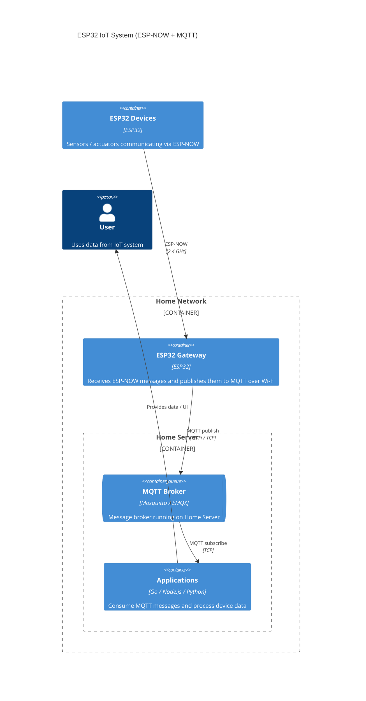

# ESP-NOW Network

## Goals

Идея — я хочу сделать сам сеть наподобие esp-home.

Устройства должны находить себя сами в сети — service discovery.

Устройства шлют на gateway данные по ESP-NOW, он это пересылает по MQTT в топик /device/mac.

Клиентские приложения уже разрабатываются отдельно, основная задача — сделать передачу данных и библиотеки компонентов, которые можно распространять через ESP-IDF для повторного использования.

Как пример протокола общения можно взять MQTT и IPFS pub/sub room.

Протокол нужен бинарный с поддержкой отправки пакетов любой длины через фрагментацию.

Хорошо бы сделать, чтобы это было еще все защищено и настраиваемо, и соблюсти правила cloud application.

## Cloud application

- [ ] Масштабируемость — систему можно считать масштабируемой, если её не нужно реорганизовывать для решения намеченной задачи во время или после резкого увеличения спроса.
- [ ] Слабая связанность.
- [ ] Устойчивость — это способность системы восстанавливаться после ошибок и сбоев. Систему можно считать устойчивой, если она может продолжать работать правильно — возможно, с меньшей эффективностью — вместо полного отказа после выхода из строя какой-либо её части.
- [ ] Управляемость — это простота, с которой можно изменить поведение системы для обеспечения безопасности, бесперебойной работы и соответствия меняющимся требованиям. Систему можно считать управляемой, если она позволяет изменить ее поведение без изменения кода.
- [ ] Наблюдаемость — это мера простоты определения внутреннего состояния системы по наблюдаемым результатам. Система считается наблюдаемой, если можно быстро и последовательно получать ответы на все новые вопросы о ней с минимальными предварительными знаниями, без необходимости внедряться в существующий код или писать новый.

## System design 

## MVP
В первой реализации можно сделать просто пересылку broadcast сообщений в MQTT
тогда не нужно будет делать ничего связанного с пирами, пиры нужны только если я хочу сделать unicast общение и unicast

А так при подключении можно сделать типа mac, last_seen  и если ответили типа FULL то удалить пира с самым мелким last_seen - если добавляем уже существующего просто обновить

## Transport

uint16_t 16-bit unsigned integers in little-endian order 
uint32_t 32-bit unsigned integers in little-endian order

### Control Packet type

| Name | Value | Direction of flow | Type | Description |
| --- | --- | --- | --- | -- |
| Reserved| 0 | Forbidden | | Reserved |
| CONNECT | 1 | Node to Gateway | multicast | Connection request |
| CONNACK | 2 | Gateway to Node | unicast | Connect acknowledgment |
| PUBLISH | 3 | Note to Gateway | unicast | Publish message |

